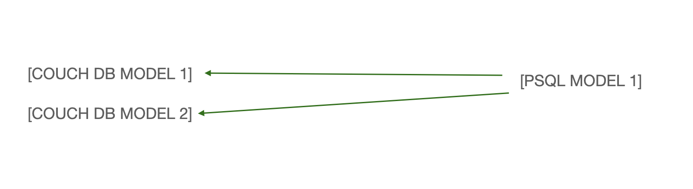
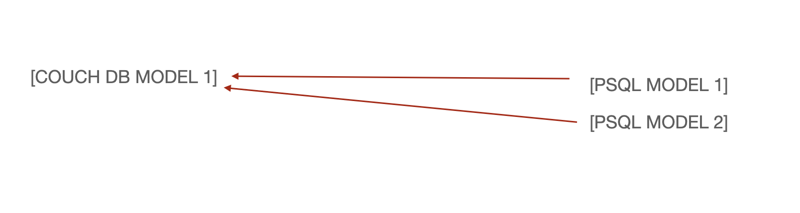

# Адаптер для работы в Django -> Couchbase
## ChangeLog от 17.12.21 version :: 1.2.1rc6
    1. resolve issue #2
## ChangeLog от 17.12.21 version :: 1.2.1b5 -- beta 
    1. resolve issue #1
    2. write super() in __init__() CBModel for fix save() method
## ChangeLog от 17.12.21 version :: 1.2.1b2 -- beta 
    
    1. Класс CBModel  пополнился методов `.analytics()`, который позволяет отправлять запросы в сервис Analytics
    (рекомендуется его использовать при запросах, характерная частота повторений которых мала 
    и/или ваши запросы улетают за тайм-аут), работает аналогично с методом filter.

    2. Добавлены более гибкие натсройки таймаутов для выполнения запросов в сервис Query(обычные запросы). Теперь в settings.py
    можно выставить следующие параметры для увлечения времени ответа:
        API_TO = 10             # - увеличивает время ожидания для запросов через api                       , секунды
        QUERY_TO = 10           # - увеличивает время ожидания для запросов через службу query              , секунды
        KV_TO = 10              # - увеличивает время ожидания для запросов View operations                 , секунды
        VIEWS_TO = 10           # - увеличивает время ожидания для запросов View operations                 , секунды
        CONFIG_TOT_TO = 10      # - увеличивает время ожидания для запросов complete bootstrap configuration, секунды
    , обратите внимание(!), чт о их название изменены. По деволту значения установлены в 120 секунд.
    
    3. Добавлены индекс менеджеры для Query и Analytics сервисов:
        from couchadapter.indexer import AnalyticsServiceManager
        from couchadapter.indexer import QueryServiceManager
    , благодаря которым вы сможете создавать Primary индексы для новых коллекций, индексы для Analytics и Query сервисов.
        QueryServiceManager.primary(model: CBModel)
        QueryServiceManager.indexing(model: CBModel, *args)

        AnalyticsServiceManager.indexing(model: CBModel, *args)
    , а также добавлена возможность создания индексов через Djnago команды(beta):
        python manage.py idx-as -m(--model) core.models.MyModel my_field
        python manage.py idx-qs -m(--model) core.models.MyModel my_field
        python manage.py idx-qs -m(--model) -p core.models.MyModel
    .
    Для корректной работы запросов через Analytics сервис необходимо заранее создать DataSet в нужном кластере CouchBase,
    при работе с AnalyticsServiceManager DataSet будет создан автоматически.
        Рекомендации при переходе с Query  на Analytics сервиса:
            1. Analytics сервис работает лучше всего использовать, когда Query не может быстро выполнить запрос. Обычно
            это связано с большим количеством данных.
            2. Не стоит переходить сразу с Query на Analytics запросы т.к. это не ускорит, а скорее замедлит работу. Это
            связано с характером работы сервиса.
    4. В класс CBModel добавлено описание класса AboutModel
    5. Вы можете настроить таймауты не только глобально, но и для каждого наследуемого от CBModel класса отдельно,
    для этого нужно переопределить:
        _query_timeout              : int
        _kv_timeout                 : int
        _views_timeout              : int
        _config_total_timeout       : int
    
    
    Данная версия находится на этапе тестирования, но пользоваться и искать неисправности в dev сборках приветствуется.
    Актуальная версия(релиз): 1.2rc0
                    

## Установка

    pip install  --trusted-host 192.168.2.5 -v  -i http://192.168.2.5:18081/repository/pypi/simple  --extra-index-url https://pypi.org/simple couchadapter

## Деплой новой версии:

    1. Сменить версию приложения в __init__ файле
    2. python -m build
    3. twine upload --repository-url http://192.168.2.5:18081/repository/pypi/  dist/*
    4. git steps ...

    
## Настройка
В папке settings.py проекта

    INSTALLED_APPS = [
        ...
        'couchadapter',
        ...
        ]
    
    # настройки timeout для запросов. Стоят изначально дефолтныпе значения
    API_TO = 10
    QUERY_TO = 10
    KV_TO = 10
    VIEWS_TO = 10
    CONFIG_TOT_TO = 10

## Написание моделей

### Модели

    В классе CB модели описывем:

    class <ИмяКласса>(CBModel):
        def __init__(self, *args, **kwargs):
            super().__init__(*args, **kwargs)
            super(<class_name>, self).__add_to_child_list__(self.__class__)
    
        class Meta:
            abstract = True

        class AboutModel:
            fields_name = field1, field2 , ... ,
    
        bucket      = str: название бакета
        scope       = str: название скопа
        collection  = str: название колекции
        doc_type    = str: __<class_name>_type__
        id_prefix   = str: <class_name(short)>_         # unique
    
        описание полей документа
        ...

    В классе CBNested модели описывем:

    class <ИмяКласса>(CBNested):
        class Meta:
            abstract = True

        class AboutModel:
            fields_name = field1, field2 , ... ,
    
        bucket      = str: название бакета
        scope       = str: название скопа
        collection  = str: название колекции
        doc_type    = str: # имеет название как у родителя
        id_prefix   = str: <class_name(short)>_         # unique
    
        описание полей документа
        ...

* CBModel - класс, который образует корень документа JSON. Эти модели должны иметь __init__ метод(как на примере ниже)
* CBNestedModel - может быть только вложенным. Нельзя сохранить его или получить напрямую

# Правило переноса данных (создания документов) на основе существующих таблиц из PSQL

    Данные из одной PSQL таблицы можно разделить на несколько COUCH DB модлей

    Данные для одной модели COUCH DB нельзя брать из нескольких таблиц PSQL

### Поля

* ListField

    Это поле используется для создания массива внутри документа JSON.

* EmbeddedModelField

    Это поле относится к другому классу, который при сериализации создает вложенный JSON в соответствии с указанным свойством.

* ModelReferenceField

    Это поле похоже на обычное поле внешнего ключа, в котором хранится соответствующий документ в другом месте и содержится только идентификатор в этом документе JSON.

### Пример

    from couchadapter.models import CBModel, CBNestedModel
    from couchadapter.fields import PartialReferenceField, ModelReferenceField
    from couchadapter.management.djangotoolbox.fields import ListField, EmbeddedModelField, DictField
    from django.db import models

    class Article(CBNestedModel):
        class Meta:
            abstract = True
        class AboutModel:
            fields_name = field1, field2 , ... ,
    
        scope = 'scope_name'
        collection = 'collection_in_scope'
        doc_type = '__type__'
        id_prefix = 'id_'
        bucket = 'bucket_1'
    
        title = models.CharField(max_length=45, null=True, blank=True)

    class Blog(CBNestedModel):
        class Meta:
            abstract = True
        class AboutModel:
            fields_name = field1, field2 , ... ,
    
        scope = 'scope_name'
        collection = 'collection_in_scope'
        doc_type = '__type__'
        id_prefix = 'id_'
        bucket = 'bucket_1'
    
        url = models.CharField(max_length=45, null=True, blank=True)
        articles = ListField(EmbeddedModelField(Article))

    class Publisher(CBModel):
        def __init__(self, *args, **kwargs):
            super().__init__(*args, **kwargs)
            super(<class_name>, self).__add_to_child_list__(self.__class__)
    
        class Meta:
            abstract = True

        class AboutModel:
            fields_name = field1, field2 , ... ,
    
        scope = 'scope_name'
        collection = 'collection_in_scope'
        doc_type = '__type__'
        id_prefix = 'id_'
        bucket = 'bucket_1'
    
        name = models.CharField(max_length=45, null=True, blank=True)

    class Book(CBModel):
        def __init__(self, *args, **kwargs):
            super().__init__(*args, **kwargs)
            super(<class_name>, self).__add_to_child_list__(self.__class__)
    
        class Meta:
            abstract = True

        class AboutModel:
            fields_name = field1, field2 , ... ,
    
        scope = 'scope_name'
        collection = 'collection_in_scope'
        doc_type = '__type__'
        id_prefix = 'id_'
        bucket = 'bucket_1'
    
        name = models.CharField(max_length=45, null=True, blank=True)
        pages = models.IntegerField()
        publisher = ModelReferenceField(Publisher)

    class Address(CBModel):
        def __init__(self, *args, **kwargs):
            super().__init__(*args, **kwargs)
            super(<class_name>, self).__add_to_child_list__(self.__class__)
    
        class Meta:
            abstract = True

        class AboutModel:
            fields_name = field1, field2 , ... ,
    
        scope = 'scope_name'
        collection = 'collection_in_scope'
        doc_type = '__type__'
        id_prefix = 'id_'
        bucket = 'bucket_1'
    
        street = models.CharField(max_length=45, null=True, blank=True)
        city = models.CharField(max_length=45, null=True, blank=True)

    class Author(CBModel):
        def __init__(self, *args, **kwargs):
            super().__init__(*args, **kwargs)
            super(<class_name>, self).__add_to_child_list__(self.__class__)
    
        class Meta:
            abstract = True

        class AboutModel:
            fields_name = field1, field2 , ... ,
    
        scope = 'scope_name'
        collection = 'collection_in_scope'
        doc_type = '__type__'
        id_prefix = 'id_'
        bucket = 'bucket_1'
    
        name = models.CharField(max_length=45, null=True, blank=True)
        blog = EmbeddedModelField(Blog)
        books = ListField(ModelReferenceField(Book))
        address = ModelReferenceField(Address)

- Как указано выше, класс был унаследован от CBModel и CBNestedModel. 
Вы также можете использовать реляционные базы данных в других моделях, расширяясь из models.Model.
- abstract - следует добавить ко всем классам, у которых есть родительская модель CB или CBNestedmodel, 
чтобы избежать миграции в эти классы и добавления их в схему реляционной базы данных
- Переопределять метод init нужно во всех CBModel для корректной работы мигратора
- Создавать класс AboutModel и перечислять название полей также нужно во всех моделях
- bucket - указание название ковша
- scope - указываем название скопа
- collection - указываем название коллекции
- doc_type - тип документа
- id_prefix - префикс id

Возможные вариации

* ListField
* EmbeddedField
* ModelReferenceField
* ListField(EmbeddedModelField)
* ListField(ModelReferenceField)

## Шаблон для моделей хранения медиа данных

    class Media<TypeMedia>(CBModel):
        bucket      = str: название бакета
        scope       = str: название скопа
        collection  = str: название колекции
        doc_type    = str: __media_<type_media>__
        id_prefix   = str: <class_name(short)>_         # unique

    # fileds :-->
        
        

## Создание документа

    # Creating two articles.
    article = Article(title = "New Article")
    article2 = Article(title = "Second Article")
    
    # Create a blog that has both the article nested in it
    blog = Blog(url = "4sw.in", articles = [article, article2])
    
    # Create two publishers
    pub = Publisher(name = "Famous Publications")
    pub2 = Publisher(name = "Much more Famous Publications")
    
    # Add the publishers as the reference
    book = Book(name = "First Book", pages = 250, publisher = pub)
    book2 = Book(name = "Second Book", pages = 340, publisher = pub2)
    
    # Create the address  document
    address = Address(street = "Anna Nagar", city = "Chennai")
    
    # embed blog, books, address in author document
    author = Author(name = "Aswin", blog = blog, books = [book, book2], address=address)
    
    # save all the above models in the database
    author.save()

## Сохранение нескольких документов 1 типа

    pub = Publisher(name="Famous Publications")
    book = Book(name="First Book", pages=251, publisher=pub)
    book2 = Book(name="Second Book", pages=252, publisher=pub)
    book3 = Book(name="Third Book", pages=253, publisher=pub)
    book4 = Book(name="fourth Book", pages=254, publisher=pub)
    Book.save_multi([book, book2, book3, book4])

## Переопределение id generator'a

Для изменения генерируемого id нужно переопределить метод get_id
Столбец не может иметь имя id. Это название зарезервировано мигратором. Меняйте id -> insta_id

    class Book(CBModel):
        def __init__(self, *args, **kwargs):
            super().__init__(*args, **kwargs)
            super(Book, self).__add_to_child_list__(self.__class__)
        class Meta:
            abstract = True

        scope = 'scope_name'
        collection = 'collection_in_scope'
        doc_type = '__type__'
        id_prefix = 'id_'
        bucket = 'bucket_1'
    
        name = models.CharField(max_length=45, null=True, blank=True)
        pages = models.IntegerField()
        publisher = ModelReferenceField(Publisher)
        
        def get_id(self):
            return uuid + pages

## Получение документа по id

    author = Author("...")
    blog_irl = author.blor.url

## Удаление документа

    author = Author("...")
    author.delete()

## Изменение значенией

    author = Author("...")
    author.blor.url = "..."
    author.save()

## Получение данных по значению полей

Для получения данных из фильтра объектов строиться выражение.
Несколько фильтр объектов могут объединяться операторами &, |. 

    query = GreaterFilter(pages=300) & EqualFilter(name="Second Book")

Результирующей запрос отправляется в метод filter CB модели

    books = Book.filter(expression=query)

Для сортировки необходимо заполнить параметр order by

В словаре указываются столбцы сортировки в порядке приоритета и способ

    books = Book.filter(expression=query, order_by={"pages": "asc"})

По умолчанию метод фильтр возвращает QueryResult[Model]

    books = Book.filter(expression=query, order_by={"pages": "asc"})
    type(books) -> QueryResult[Book]

Для получения списка объектов используется метод all

    books = Book.filter(expression=query, order_by={"pages": "asc"}).all()
    type(books) -> List[Book]

Для одного объекта используется метод first

    books = Book.filter(expression=query, order_by={"pages": "asc"}).first()
    type(books) -> Book

Для получения сырых данных метод фильтр принимает параметр as_dict

    books = Book.filter(expression=query, order_by={"pages": "asc"}, as_dict=True)
    type(books) -> List[Dict]

В методе фильтр можно задать limit и offset

    query = GreaterFilter(pages=1)
    books = Book.filter(expression=query, limit=2, offset=0, as_dict=True)

## Создание новых фильтров

Для создания новых фильтров необходимо наследовать новый класс от класса Specification и переопределить методы init и is_satisfied_by.
Параметр candidate лучше не трогать!!!

    class GreaterFilter(Specification):
        def __init__(self, **fields):
        self.fields = fields

        def is_satisfied_by(self, candidate):
            query = ""
            for key, value in self.fields.items():
                query += f"{key}>{value} "
            return query